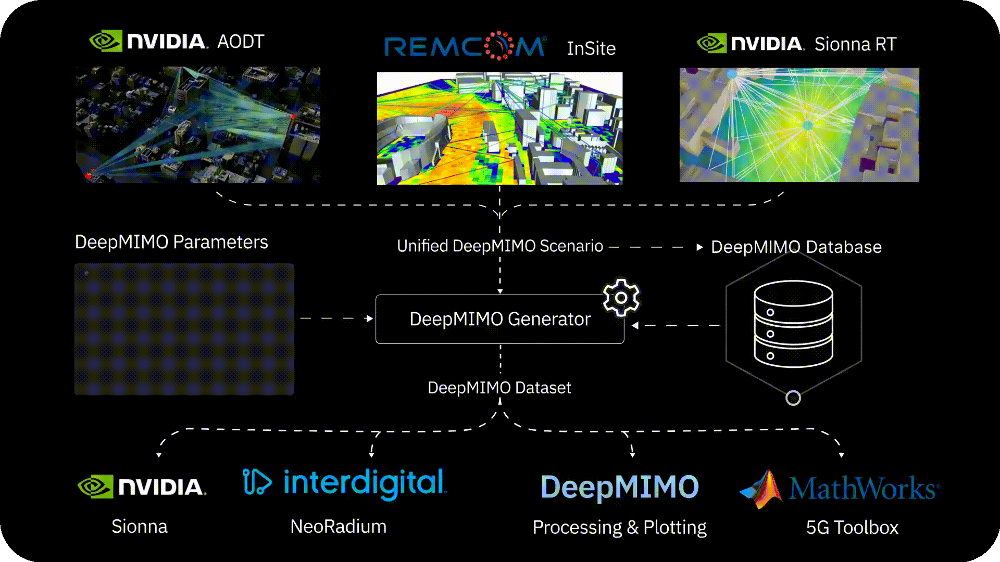

<div align="center">
  <h1>DeepMIMO</h1>
  <p><i>Bridging ray tracers and 5G/6G simulators with shareable, site-specific datasets</i></p>
  <p>
    <a href="https://pypi.org/project/deepmimo/"></a>
    <a href="https://www.python.org/"></a>
    <a href="https://deepmimo.net"></a>
    <a href="LICENSE"></a>
    <a href="https://github.com/astral-sh/uv"></a>
    <a href="https://github.com/astral-sh/ruff"></a>
    <a href="https://codecov.io/gh/DeepMIMO/DeepMIMO"></a>
  </p>
  
</div>

<p align="center">
  <b>
    <a href="#quickstart">Quickstart</a> •
    <a href="https://deepmimo.net/documentation">Docs</a> •
    <a href="https://deepmimo.net">Web</a> •
    <a href="#faq">FAQ</a> •
    <a href="#citation">Cite</a>
  </b>
</p>

<table style="width:100%; text-align:center; border-collapse:separate; border-spacing:0 6px;">
  <thead>
    <tr>
      <th style="text-align:center;">G&nbsp;O&nbsp;A&nbsp;L</th>
      <th style="text-align:center; border-left:1px solid #eaeaea; border-right:1px solid #eaeaea;">H&nbsp;O&nbsp;W</th>
      <th style="text-align:center;">W&nbsp;H&nbsp;Y</th>
    </tr>
  </thead>
  <tbody>
    <tr align="center">
      <td>Enable large‑scale AI benchmarking using site‑specific wireless ray‑tracing datasets.</td>
      <td style="border-left:1px solid #eaeaea; border-right:1px solid #eaeaea;">Convert outputs from top propagation ray tracers into a clean, distributable format readable by modern simulation toolboxes.</td>
      <td>Make ray‑tracing data easy to access, share, and benchmark—accelerating AI‑driven wireless research.</td>
    </tr>
  </tbody>
  </table>

## Features

- ⚡ **Instant access to ray-tracing data** — Compute large, realistic channels in seconds.
- 🧪 **Easy ML benchmarking across sites** — Find 100s of datasets in the [Scenarios Database](https://deepmimo.net/scenarios)
- 🔁 **Reproduce benchmarks** — Search papers by topic and application in [Publications Database](https://deepmimo.net/publications).
- 🚀 **Feature-rich toolbox** — Explore a wide array of wireless utilities in our [Notebook Tutorials](https://deepmimo.net/docs/manual_full.html#examples-manual).
- 🔌 **Seamless integration** — From Sionna RT/InSite/AODT to Sionna/MATLAB 5G/NeoRadium.
- 📦 **Shareable datasets** — Versioned scenarios, open formats. Explore in the [Online Visualizer](https://deepmimo.net/visualizer)
- 🤗 **User friendly** — Great docs, practical examples, easy install, and available on Colab.
- 🌍 **Active Community & Support** — Issues and Pull Requests reviewed in hours not weeks.

## Quickstart

### Install
```bash
# From PyPI
pip install --pre deepmimo

# From GitHub
git clone https://github.com/DeepMIMO/DeepMIMO.git
cd DeepMIMO
pip install -e .[dev]
```

### Basic Dataset Generation
```python
import deepmimo as dm

# Download a dataset
dm.download('asu_campus_3p5')

# Load a dataset
dataset = dm.load('asu_campus_3p5')

# Generate channels
channels = dataset.compute_channels()  # [n_ue, n_rx, n_tx, n_sub]
```

### Convert Ray Tracing Simulations to DeepMIMO
```python
import deepmimo as dm

# Convert Wireless Insite, Sionna, or AODT to DeepMIMO
scenario_name = dm.convert('path_to_ray_tracing_output')

# Upload a dataset to the DeepMIMO Database (optional)
dm.upload(scenario_name, 'api-key')
# get api key in deepmimo.net -> contribute
```

## Project Structure
```
deepmimo/
├── api/                    # Database API
│   ├── download.py         # Download scenarios from database
│   ├── search.py           # Search scenarios in database
│   └── upload.py           # Upload scenarios to database
├── converters/             # Ray tracer output converters
│   ├── aodt/               # AODT converter
│   ├── sionna_rt/          # Sionna RT converter
│   ├── wireless_insite/    # Wireless Insite converter
│   ├── converter.py        # Base converter class
│   └── converter_utils.py  # Converter utilities
├── core/                   # Core data models
│   ├── materials.py        # Material properties
│   ├── rt_params.py        # Ray tracing parameters
│   ├── scene.py            # Physical environment representation
│   └── txrx.py             # Transmitter/receiver configurations
├── datasets/               # Dataset operations
│   ├── array_wrapper.py    # Array management utilities
│   ├── dataset.py          # Dataset, MacroDataset, DynamicDataset classes
│   ├── generate.py         # Dataset generation with channel computation
│   ├── load.py             # Dataset loading functionality
│   ├── sampling.py         # User sampling utilities
│   ├── summary.py          # Dataset summary functions
│   └── visualization.py    # Plotting and visualization tools
├── exporters/              # Data exporters
│   ├── aodt_exporter.py    # AODT format exporter
│   └── sionna_exporter.py  # Sionna format exporter
├── generator/              # Channel generation
│   ├── ant_patterns.py     # Antenna pattern definitions
│   ├── channel.py          # MIMO channel computation
│   └── geometry.py         # Geometric calculations and beamforming
├── integrations/           # Integration with 5G simulation tools
│   ├── matlab/             # MATLAB 5G Toolbox integration
│   ├── sionna_adapter.py   # Sionna integration
│   └── web.py              # DeepMIMO web format export
├── pipelines/              # Automatic ray tracing pipelines
│   ├── sionna_rt/          # Sionna raytracer pipeline
│   ├── wireless_insite/    # Wireless Insite pipeline
│   ├── blender_osm.py      # Blender OSM export utilities
│   ├── txrx_placement.py   # Transmitter/receiver placement
│   └── utils/              # Pipeline utilities
├── utils/                  # Utility modules
│   ├── data_structures.py  # Custom data structures
│   ├── dict_utils.py       # Dictionary utilities
│   ├── geometry.py         # Geometric utility functions
│   ├── info.py             # Information on matrices and parameters
│   ├── io.py               # File I/O operations
│   └── scenarios.py        # Scenario management functions
├── config.py               # Configuration management
└── consts.py               # Constants and default values

Additional directories:
├── docs/                   # Documentation
├── scripts/                # Utility scripts
└── tests/                  # Test suite
```

## Build the Docs

After cloning the repository:

| Step    | Command                 | Description                        |
|---------|-------------------------|------------------------------------|
| Install | `pip install .[dev]`    | Install development dependencies   |
| Serve   | `mkdocs serve`          | Preview at http://localhost:8000   |

Change `execute: false` to `execute: true` in `mkdocs.yml` to run the tutorials and preserve cell outputs. 

## Contributing

We welcome contributions to DeepMIMO! To contribute:
1. [Fork the repository](https://github.com/DeepMIMO/DeepMIMO/fork)
2. Make changes
3. Open a [Pull Request](https://github.com/DeepMIMO/DeepMIMO/pulls)

We aim to respond to pull requests within 24 hours.

## FAQ

<details>
<summary><b>1) What is DeepMIMO useful for?</b></summary>


- Free, easy and fast access to ray tracing data across hundreds of site-specific datasets. 
- Connecting raytracers and simulators, allowing flexible research.
- Sharing Datasets to make research more easily reproducible


</details>

<details>
<summary><b>2) Why using DeepMIMO if Sionna exists?</b></summary>

DeepMIMO is not a simulator; it’s a standardized ray-tracing toolchain that *relies and complements* ray-tracing tools like Sionna RT. Re-running a single high-quality scenario can take hours or days of compute, provided one can resurrect the original scripts and software environment. And even when this succeeds, every group tends to store the channels in its own ad-hoc format, so results are not plug-and-play across projects. With DeepMIMO, we skip all that: authors publish a scenario once, and anyone can load the exact same data in seconds with a small Python snippet. DeepMIMO makes sharing, reproducing, and comparing ray-tracing results dramatically easier and more reliable.

</details>

<details>
<summary><b>3) How long do dataset downloads take?</b></summary>

A *few* minutes. Sometimes seconds. Data is stored on super-fast and available object storage, so in practice the transfer speeds are limited by the internet connection (see [speedtest.net](https://www.speedtest.net/)). At 50 Mbps the ASU Campus scenario with 85 thousand candidate users would take ~5 seconds to download.

</details>

## Citation

If you use this software, please cite it:

```bibtex
@misc{alkhateeb2019deepmimo,
      title={DeepMIMO: A Generic Deep Learning Dataset for Millimeter Wave and Massive MIMO Applications}, 
      author={Ahmed Alkhateeb},
      year={2019},
      eprint={1902.06435},
      archivePrefix={arXiv},
      primaryClass={cs.IT},
      url={https://arxiv.org/abs/1902.06435}, 
}
```
