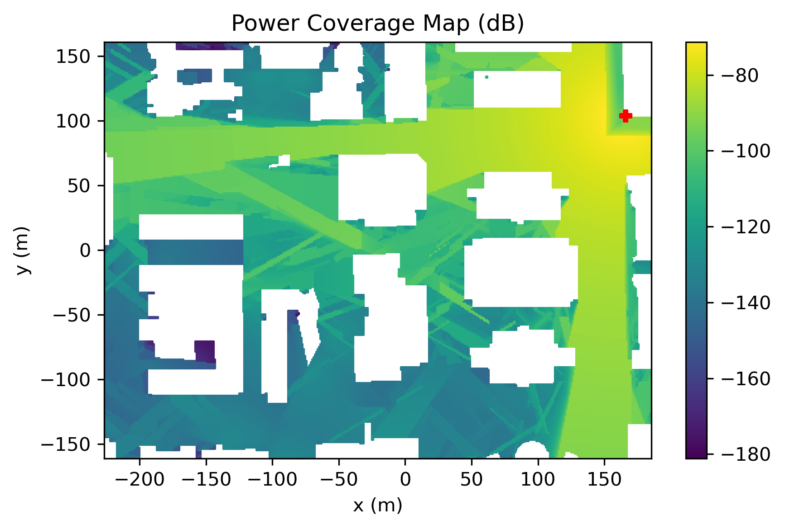

# Quickstart

This guide will help you get started with DeepMIMO quickly.

## Load scenario

Load a scenario and generate channels with default settings:

```python
import deepmimo as dm

scenario = 'asu_campus_3p5'
# Download a Scenario
dm.download(scenario)

# Load to memory
dataset = dm.load(scenario)
```

Load will open the ray tracing scenario matrices, such as the received powers, times of arrival, and angles.

```{tip}
`dm.download()` requires an internet connection. If the scenario already exists in `./deepmimo_scenarios`, the download is skipped. 
```

## Compute channels
    
```python
# Generate channels with default parameters
dataset.compute_channels()

print(dataset.channels.shape)
# [n_ue, n_ue_ant, n_bs_ant, n_freqs]
# (131931, 1, 8, 1)
```

```{tip}
See the <a href="manual_full.html#channel-generation">Channel Generation Examples</a> for the default parameters and how to configure channel generation.
```

## Visualize Dataset

### Scene

```python
dataset.scene.plot()
```


### Coverage Maps

```python
    # Plot power coverage map (power is [n_ue, n_paths])
    dataset.power.plot() # selects first path by default
```


### Rays

```python
    # Plot ray paths for a user in line of sight
    los_user = np.where(dataset.los == 1)[0][2500]
    dataset.plot_rays(los_user)
```


## Inspect Dataset

To see all matrices available in a DeepMIMO dataset, call:

```python
    dataset.info()
```

This will print 3 tables, the fundamental matrices, the computed attributes, and the other dictionaries in DeepMIMO.

### Fundamental Matrices

| Matrix | Description | Shape |
|--------|-------------|-------|
| power | Tap power. Received power in dBW for each path, assuming 0 dBW transmitted power. 10*log10(\|a\|²), where a is the complex channel amplitude | [num_rx, num_paths] |
| phase | Tap phase. Phase of received signal for each path in degrees. ∠a (angle of a), where a is the complex channel amplitude | [num_rx, num_paths] |
| delay | Tap delay. Propagation delay for each path in seconds | [num_rx, num_paths] |
| aoa_az | Angle of arrival (azimuth) for each path in degrees | [num_rx, num_paths] |
| aoa_el | Angle of arrival (elevation) for each path in degrees | [num_rx, num_paths] |
| aod_az | Angle of departure (azimuth) for each path in degrees | [num_rx, num_paths] |
| aod_el | Angle of departure (elevation) for each path in degrees | [num_rx, num_paths] |
| inter | Type of interactions along each path. Codes: 0: LOS, 1: Reflection, 2: Diffraction, 3: Scattering, 4: Transmission. Code meaning: 121 -> Tx-R-D-R-Rx | [num_rx, num_paths] |
| inter_pos | 3D coordinates in meters of each interaction point along paths | [num_rx, num_paths, max_interactions, 3] |
| rx_pos | Receiver positions in 3D coordinates in meters | [num_rx, 3] |
| tx_pos | Transmitter positions in 3D coordinates in meters | [num_tx, 3] |

### Computed/Derived Matrices

| Matrix | Description | Shape |
|--------|-------------|-------|
| los | Line of sight status for each path. 1: Direct path between TX and RX. 0: Indirect path. -1: No paths between TX and RX. | [num_rx, ] |
| channel | Channel matrix between TX and RX antennas. X = number of paths (time domain) or subcarriers (frequency domain) | [num_rx, num_rx_ant, num_tx_ant, X] |
| power_linear | Linear power for each path (W) | [num_rx, num_paths] |
| pathloss | Pathloss for each path (dB) | [num_rx, num_paths] |
| distance | Distance between TX and RX for each path (m) | [num_rx, num_paths] |
| num_paths | Number of paths for each user | [num_rx] |
| inter_str | Interaction string for each path. Codes: 0:"", 1:"R", 2:"D", 3:"S", 4:"T". Example: 121 -> "RDR" | [num_rx, num_paths] |
| doppler | Doppler frequency shifts [Hz] for each user and path | [num_rx, num_paths] |
| inter_obj | Object ids at each interaction point | [num_rx, num_paths, max_interactions] |

### Additional Dataset Fields

| Field | Description |
|-------|-------------|
| scene | Scene parameters |
| materials | List of available materials and their electromagnetic properties |
| txrx_sets | Transmitter/receiver parameters |
| rt_params | Ray-tracing parameters |

All these attributes can be accessed via dataset.`<attribute_name>`, just like we did in `dataset.power.plot()`


For more advanced usage and features, we recommend exploring the 
<a href="manual_full.html">Examples Manual</a>, leveraging the API reference when needed.