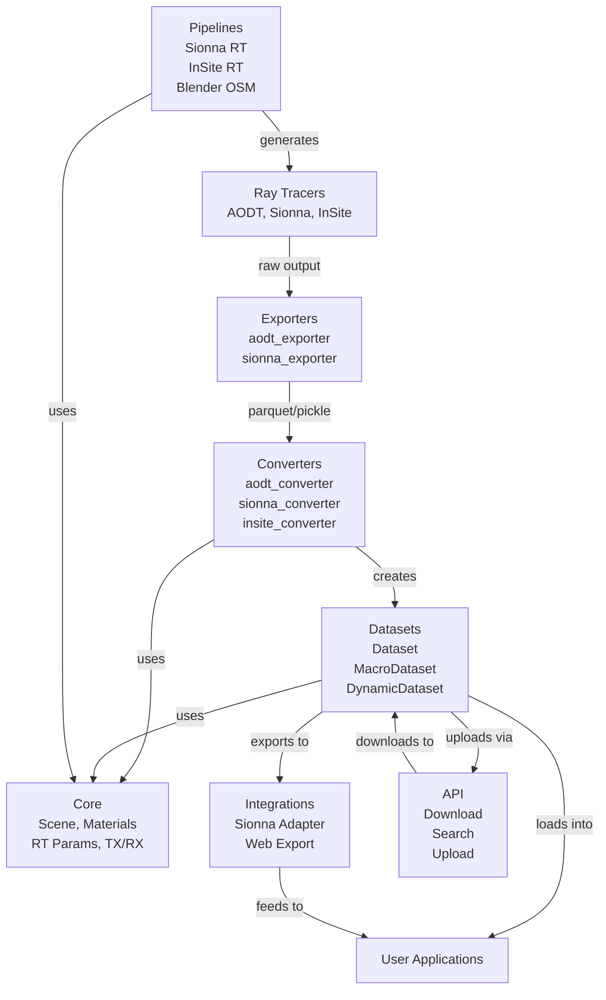

# DeepMIMO Capabilities Overview

This folder contains detailed capability tables for all major modules in the DeepMIMO package.

## High-Level Feature Matrix

Overview of key capabilities across all modules:

| Feature | Converters | Datasets | Integrations | Exporters | Core | API | Pipelines |
|---|---|---|---|---|---|---|---|
| **Data Input/Output** | | | | | | | |
| Ray-tracing data import | ✓ | | | | | | |
| Ray-tracing data export | | | | ✓ | | | |
| Scenario download | | | | | | ✓ | |
| Scenario upload | | | | | | ✓ | |
| Binary format support | | | ✓ | | | | |
| | | | | | | | |
| **Dataset Operations** | | | | | | | |
| Dataset loading | | ✓ | | | | | |
| Dataset generation | | ✓ | | | | | |
| Channel computation | | ✓ | | | | | |
| Dataset manipulation | | ✓ | | | | | |
| Sampling and filtering | | ✓ | | | | | |
| | | | | | | | |
| **Channel Features** | | | | | | | |
| Time domain channels | | ✓ | ✓ | | | | |
| Frequency domain channels | | ✓ | | | | | |
| MIMO support | | ✓ | ✓ | | | | |
| Multi-antenna arrays | | ✓ | ✓ | | | | |
| Antenna patterns | | ✓ | | | | | |
| Beamforming | | ✓ | | | | | |
| | | | | | | | |
| **Physical Modeling** | | | | | | | |
| Scene geometry | ✓ | | | ✓ | ✓ | | ✓ |
| Material properties | ✓ | | | ✓ | ✓ | | |
| Path interactions | ✓ | ✓ | | ✓ | | | |
| GPS coordinates | ✓ | | | ✓ | ✓ | | ✓ |
| | | | | | | | |
| **Ray-Tracing** | | | | | | | |
| Ray-tracing execution | | | | | | | ✓ |
| Reflections | ✓ | | | ✓ | ✓ | | ✓ |
| Diffractions | ✓ | | | ✓ | ✓ | | ✓ |
| Scattering | ✓ | | | ✓ | ✓ | | ✓ |
| Transmissions | ✓ | | | ✓ | ✓ | | ✓ |
| | | | | | | | |
| **Visualization** | | | | | | | |
| 3D scene plotting | | ✓ | | | ✓ | | |
| Ray path plotting | | ✓ | | | | | |
| Coverage maps | | ✓ | | | | | |
| Summary plots | | ✓ | | | | | |
| | | | | | | | |
| **External Integration** | | | | | | | |
| Sionna compatibility | ✓ | | ✓ | ✓ | | | ✓ |
| Wireless InSite | ✓ | | | | | | ✓ |
| AODT | ✓ | | | ✓ | | | |
| Blender/OSM | | | | | | | ✓ |
| Web visualizer | | | ✓ | | | | |
| | | | | | | | |
| **Database** | | | | | | | |
| Scenario search | | | | | | ✓ | |
| Metadata queries | | | | | | ✓ | |
| Batch operations | | | | | | | |
| | | | | | | | |
| **Advanced Features** | | | | | | | |
| Time-varying scenarios | ✓ | ✓ | | ✓ | | | ✓ |
| Doppler support | | ✓ | | | | | |
| Field-of-view filtering | | ✓ | | | | | |
| GPU acceleration | | | | | | | ✓ |
| Parallel processing | | | | | | | |

## Detailed Documentation

Click on any module below for detailed capability tables with notes and limitations:

### [Converters](converters.md)
Convert ray-tracing outputs to DeepMIMO format
- **AODT Converter**: AODT → DeepMIMO
- **Sionna RT Converter**: Sionna → DeepMIMO
- **Wireless InSite Converter**: InSite → DeepMIMO

### [Datasets](datasets.md)
Load, manipulate, and generate DeepMIMO datasets
- **Dataset**: Single TX-RX pair datasets
- **MacroDataset**: Multiple TX-RX pair collections
- **DynamicDataset**: Time-varying scenarios

### [Integrations](integrations.md)
Interface with external tools and platforms
- **Sionna Adapter**: DeepMIMO → Sionna format
- **Web Export**: DeepMIMO → Web visualizer

### [Exporters](exporters.md)
Export ray-tracing data from external sources
- **AODT Exporter**: ClickHouse → Parquet
- **Sionna Exporter**: Sionna objects → Pickle

### [Core](core.md)
Fundamental data structures
- **Scene**: Physical geometry representation
- **Materials**: Electromagnetic properties
- **RT Parameters**: Ray-tracing configuration
- **TX/RX Sets**: Transmitter/receiver configuration

### [API](api.md)
DeepMIMO database interaction
- **Download**: Retrieve scenarios and sources
- **Search**: Query database
- **Upload**: Submit new scenarios

### [Pipelines](pipelines.md)
End-to-end ray-tracing workflows
- **Sionna RT**: Sionna ray-tracing pipeline
- **Wireless InSite**: InSite ray-tracing pipeline
- **Blender OSM**: Scene generation from OpenStreetMap
- **TX/RX Placement**: Position utility functions

---

## Symbol Legend

| Symbol | Meaning |
|---|---|
| ✓ | Feature supported |
| ✗ | Feature not supported |
| [a], [b], ... | See notes in detailed documentation |

---

## Quick Links

- [Getting Started Tutorial](../../tutorials/1_getting_started.py)
- [API Reference](../../api/)
- [Ray-Tracing Guidelines](../raytracing_guidelines.md)
- [Comparing Ray Tracers](../comparing_raytracers.md)

---

## Module Relationships

---

## Contributing

Found an error or missing capability? Please:
1. Check the detailed module documentation
2. Open an issue on GitHub
3. Submit a pull request with corrections

See [Contributing Guide](../contributing.md) for details.
